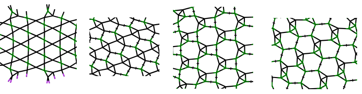
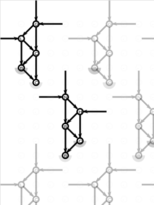
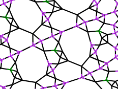
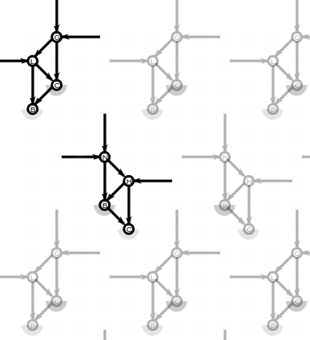
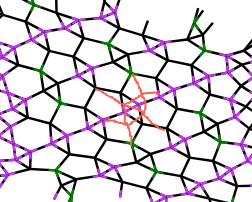

Find an algorithm to combine plaits of different lengths and orientations.

Plait lengths: 3, 4, 5, 6:

Plaits of one type with 5 blobs can be combined with:  

Challenge: combine plaits of different (lengths and/or) orientations, 
[pattern for 5 blobs](https://d-bl.github.io/GroundForge/pattern.html?patchWidth=14&patchHeight=26&tile=-g,l-,-c,b-,-c,&headside=-&shiftColsSW=-3&shiftRowsSW=3&shiftColsSE=3&shiftRowsSE=3&b1=ctc&a2=ctc&b3=ctc&a4=ctc&b5=ctc)

The next solution for 4 blobs causes chaos,
[pattern for 4 blobs](https://d-bl.github.io/GroundForge/pattern.html?patchWidth=14&patchHeight=26&tile=-g-y,l---,-c--,b---,----&headside=-&shiftColsSW=-4&shiftRowsSW=4&shiftColsSE=-1&shiftRowsSE=5&b1=ctc&a2=ctc&b3=ctc&a4=ctc)

 

